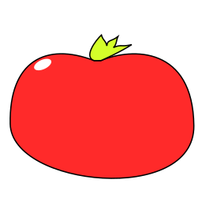
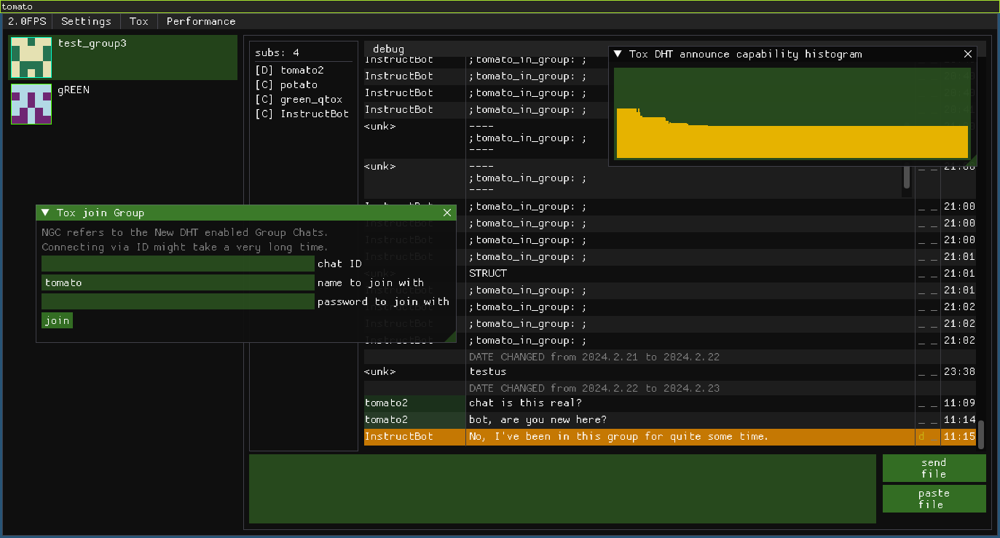

# Tomato

## Highly experimental solanaceae client with Tox built-in

## Dependencies

### Required system packages:
- libsodium
- freetype (optional)
- if `TOMATO_TOX_AV=ON`
  - libopus
  - libvpx

### Optional system packages (fetched otherwise):
- zstd
- with `TOMATO_DEP_XXX_USE_SYSTEM=ON`
  - sdl3
  - sdl3_image
  - libwebp
  - plutosvg

### submodule/subtree/fetched:
- toxcore
- solanaceae_*
- qoi
- entt
- nlohmann json
- imgui
- implot
- stb (for image, will be removed) (might keep for image resize)
- breakpad (if enabled)

### Components required during build on the host system:
- c/c++ compiler
- cmake
- make/ninja
- pkg-config (pkgconf on windows)

